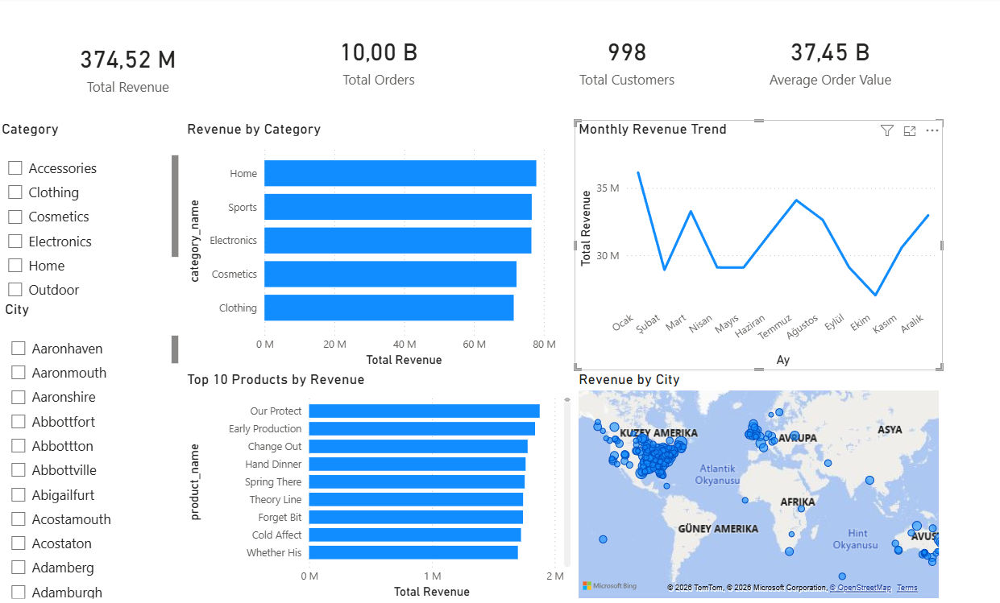
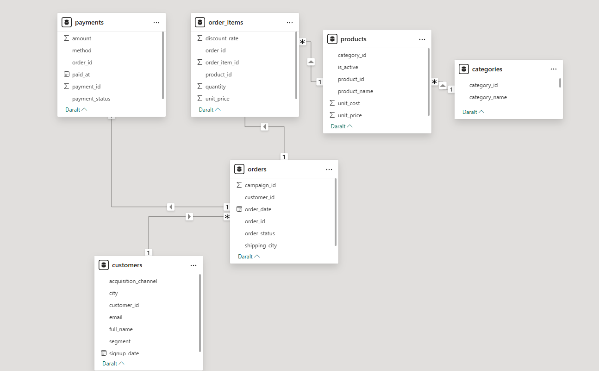

# 📊 Retail Analytics End-to-End Project

## Overview

This project demonstrates a complete end-to-end analytics workflow, covering data generation, relational modeling, and business-oriented reporting.

The primary goal is to analyze retail performance by transforming raw transactional data into meaningful insights using SQL and Power BI.

---

## Project Scope

The project simulates a real-world retail environment, including customers, orders, products, categories, and payments.

It focuses on answering key business questions such as:

* Which categories generate the highest revenue?
* How does revenue evolve over time?
* What are the top-performing products?
* How do customer and city-level dynamics impact sales?

---

## Tech Stack

* **Python** → Synthetic data generation
* **SQL Server** → Data storage, transformation, and analysis
* **Power BI** → Data modeling and visualization

---

## ETL Process

The data pipeline follows a simplified ETL approach:

* **Extract** → Synthetic data was generated using Python to simulate retail transactions
* **Transform** → Data was structured, cleaned, and enriched (e.g., revenue calculations and table relationships)
* **Load** → Data was loaded into SQL Server and used as the data source for Power BI

This workflow reflects a simplified real-world data pipeline.

---

## Data Generation

A structured dataset was created using Python to simulate realistic retail scenarios.

Key entities:

* Customers (city, segment)
* Orders (date, status)
* Products (category-based pricing)
* Order items (quantity, revenue calculation)
* Categories

The data generation process ensures consistency between tables and supports relational modeling.

---

## Data Modeling

The dataset was modeled in Power BI using a relational structure.

Key relationships:

* Customers → Orders (1-to-many)
* Orders → Order Items (1-to-many)
* Products → Order Items (1-to-many)
* Categories → Products (1-to-many)
* Orders → Payments (1-to-many)

The model follows a **star schema approach**, enabling efficient aggregation and filtering.

---

## Key Metrics

The dashboard focuses on core business KPIs:

* **Total Revenue**
* **Total Orders**
* **Total Customers**
* **Average Order Value**

---

## Analysis & Insights

The following analyses were implemented:

* **Revenue by Category**
  Identifies top-performing categories and compares their contribution.

* **Monthly Revenue Trend**
  Tracks how revenue evolves over time to detect patterns and seasonality.

* **Top Products by Revenue**
  Highlights best-selling products.

* **Revenue by City**
  Provides geographical insight into sales distribution.

---

## Dashboard Preview



---

## Data Model



---

## Project Structure

```
.
├── sample_data_generation.py
├── sample_analysis.sql
├── Retail_Sales_Dashboard.pbix
├── dashboard.png
├── data_model.png
└── README.md
```

---

## Notes

* This project uses synthetic data for demonstration purposes.
* The focus is on data modeling, analytical thinking, and visualization rather than real-world data accuracy.

---

## Summary

This project reflects my ability to:

* Design and structure relational datasets
* Perform analytical queries using SQL
* Build clear and meaningful dashboards in Power BI
* Translate data into actionable business insights
